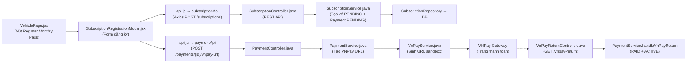
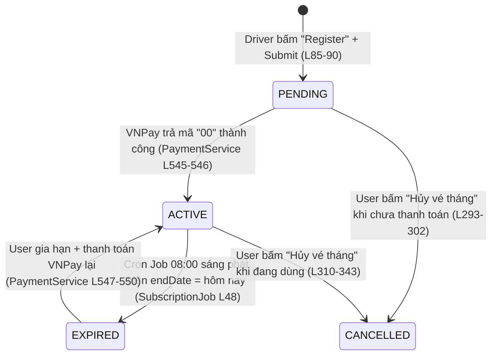

# 💳 Monthly Subscription - Flowcode Analysis (Luồng Vé Tháng chi tiết)

## Tổng quan kiến trúc



---

## PHẦN 1: Chi tiết Flowcode Đăng Ký Vé Tháng (Tạo mới)

### 🔹 Bước 0: Dữ liệu Subscription được tải cùng lúc với trang Vehicle

**File: [VehiclePage.jsx](file:///d:/Semester_5/SWP/SWP391_ParkingManagementSystem/frontend-react/src/modules/driver/pages/VehiclePage.jsx)**

```jsx
// L57-66: useEffect chạy 1 lần khi component mount
useEffect(() => {
    fetchData();    // Gọi API lấy danh sách xe + vé tháng
}, []);

// L69-100: Hàm fetchData - Gọi SONG SONG 3 API cùng lúc
const fetchData = async () => {
    const [vehiclesRes, typesRes, subsRes] = await Promise.all([
        driverService.loadMyVehicles(),                          // L74: GET /api/vehicles/me
        driverService.loadVehicleTypes(),                        // L75: GET /api/vehicle-types
        subscriptionApi.getSubscriptions().catch(() => ({ data: [] }))  // L76: GET /api/subscriptions
    ]);
    // L85-90: Parse kết quả vé tháng → lưu vào state subscriptions[]
    let subData = subsRes?.data?.success ? subsRes.data.data : subsRes.data;
    if (Array.isArray(subData)) {
        setSubscriptions(subData);
    }
};
```

**Chuỗi gọi API `getSubscriptions()` (lấy danh sách vé tháng):**

| Bước | File | Dòng | Mô tả |
|------|------|------|-------|
| 1 | [VehiclePage.jsx](file:///d:/Semester_5/SWP/SWP391_ParkingManagementSystem/frontend-react/src/modules/driver/pages/VehiclePage.jsx) | L76 | `subscriptionApi.getSubscriptions()` |
| 2 | [api.js](file:///d:/Semester_5/SWP/SWP391_ParkingManagementSystem/frontend-react/src/services/api.js) | L132 | `getSubscriptions: () => api.get('/subscriptions')` |
| 3 | [api.js](file:///d:/Semester_5/SWP/SWP391_ParkingManagementSystem/frontend-react/src/services/api.js) | L10-22 | Interceptor gắn JWT Bearer token vào header |
| 4 | [SubscriptionController.java](file:///d:/Semester_5/SWP/SWP391_ParkingManagementSystem/src/main/java/com/parking/management/module/subscription/SubscriptionController.java) | L50-54 | `@GetMapping` → `service.getAllSubscriptions()` |
| 5 | [SubscriptionService.java](file:///d:/Semester_5/SWP/SWP391_ParkingManagementSystem/src/main/java/com/parking/management/module/subscription/SubscriptionService.java) | L134-L170 | `getAllSubscriptions()` → `repository.findAll()` → map sang `SubscriptionResponse` |
| 6 | [SubscriptionRepository.java](file:///d:/Semester_5/SWP/SWP391_ParkingManagementSystem/src/main/java/com/parking/management/module/subscription/SubscriptionRepository.java) | (JPA auto) | `SELECT * FROM MonthlySubscriptions` → PostgreSQL |

---

### 🔹 Bước 1: Hiển thị nút "Register Monthly Pass" trên card xe

**File: [VehiclePage.jsx](file:///d:/Semester_5/SWP/SWP391_ParkingManagementSystem/frontend-react/src/modules/driver/pages/VehiclePage.jsx)**

```jsx
// L388-402: Kiểm tra xem xe này đã có vé tháng chưa
{vehicle.status === 'APPROVED' && (() => {
    // L389-391: Lọc danh sách vé tháng theo vehicleId, sắp xếp mới nhất trước
    const vehicleSubs = subscriptions
        .filter(s => s.vehicleId === (vehicle.vehicleId || vehicle.id))
        .sort((a, b) => (b.subscriptionId || b.id) - (a.subscriptionId || a.id));
    
    // L393: Tìm vé ACTIVE hoặc PENDING (đang dùng / đang chờ thanh toán)
    const sub = vehicleSubs.find(s => s.status === 'ACTIVE' || s.status === 'PENDING') || vehicleSubs[0];

    // L395-402: Nếu KHÔNG có vé nào, hoặc vé cuối cùng bị CANCELLED/EXPIRED → hiện nút đăng ký
    if (!sub || sub.status === 'CANCELLED' || sub.status === 'REJECTED' || sub.status === 'EXPIRED') {
        return (
            <Button type="dashed" block onClick={(e) => { 
                e.stopPropagation(); 
                setSelectedVehicleForSub(vehicle);  // L398: Lưu xe đang chọn vào state
                setIsSubModalVisible(true);         // L398: Mở Modal form đăng ký
            }}>
                Register Monthly Pass
            </Button>
        );
    }
    // L404-441: Nếu CÓ vé ACTIVE/PENDING → hiện thông tin vé + nút "Hủy vé tháng"
})()}
```

> **Quan trọng**: Nút "Register Monthly Pass" **chỉ hiện** khi `vehicle.status === 'APPROVED'` (L388). Xe đang PENDING/REJECTED sẽ KHÔNG thấy nút này.

---

### 🔹 Bước 2: Mở Modal → Tự động tính giá vé theo loại xe

**File: [SubscriptionRegistrationModal.jsx](file:///d:/Semester_5/SWP/SWP391_ParkingManagementSystem/frontend-react/src/modules/driver/components/SubscriptionRegistrationModal.jsx)**

```jsx
// L17-26: Khi Modal mở (visible = true), tự động gọi fetchData() và set giá trị mặc định
useEffect(() => {
    if (visible) {
        fetchData();                                        // L19: Gọi lấy danh sách xe + zone
        form.resetFields();                                  // L20: Reset form
        form.setFieldsValue({
            startDate: dayjs(),                              // L22: Mặc định ngày bắt đầu = hôm nay
            vehicleId: initialVehicleId                      // L23: Xe đã được chọn sẵn từ card
        });
    }
}, [visible, initialVehicleId]);

// L28-51: fetchData() trong Modal — gọi song song 2 API
const fetchData = async () => {
    const [vehiclesData, zonesData] = await Promise.all([
        driverService.loadMyVehicles(),                      // L32: GET /api/vehicles/me
        zoneApi.getZones().catch(() => ({ data: [] }))        // L33: GET /api/zones (có thể thất bại)
    ]);
    // L42-44: Nếu có xe được chọn sẵn, tự động tính giá
    if (initialVehicleId) handleVehicleChange(initialVehicleId, vRes);
};
```

**Tự động tính giá (handleVehicleChange):**

```jsx
// L53-71: Khi biết loại xe → gọi API lấy bảng giá
const handleVehicleChange = async (vehicleId, currentVehicles = vehicles) => {
    const vehicle = currentVehicles.find(v => (v.vehicleId || v.id) === vehicleId);
    if (vehicle && vehicle.vehicleTypeId) {
        // L57: Gọi API lấy Pricing Policy cho loại xe này
        const res = await pricingApi.getPricingPoliciesByVehicleType(vehicle.vehicleTypeId);
        const policies = res.data?.data || res.data || [];
        if (policies.length > 0) {
            setMonthlyFee(policies[0].monthlyPrice);   // L60: Lấy giá tháng → hiển thị trên form
        }
    }
};
```

**Chuỗi gọi API `getPricingPoliciesByVehicleType()` (lấy giá vé tháng):**

| Bước | File | Dòng | Mô tả |
|------|------|------|-------|
| 1 | [SubscriptionRegistrationModal.jsx](file:///d:/Semester_5/SWP/SWP391_ParkingManagementSystem/frontend-react/src/modules/driver/components/SubscriptionRegistrationModal.jsx) | L57 | `pricingApi.getPricingPoliciesByVehicleType(vehicle.vehicleTypeId)` |
| 2 | [api.js](file:///d:/Semester_5/SWP/SWP391_ParkingManagementSystem/frontend-react/src/services/api.js) | L169 | `getPricingPoliciesByVehicleType: (vehicleTypeId) => api.get('/pricings/vehicle-type/${vehicleTypeId}')` |
| 3 | Backend PricingController | endpoint | `@GetMapping("/vehicle-type/{id}")` → trả về `PricingPolicy[]` chứa `monthlyPrice` |

> **Kết quả**: Giá vé tháng hiển thị trên form tại L172-184 dưới dạng `"Phí đăng ký vé tháng: 120,000 ₫"`.

---

### 🔹 Bước 3: Bấm "Register" → Submit form → Tạo vé PENDING + Redirect sang VNPay

**File: [SubscriptionRegistrationModal.jsx](file:///d:/Semester_5/SWP/SWP391_ParkingManagementSystem/frontend-react/src/modules/driver/components/SubscriptionRegistrationModal.jsx)**

```jsx
// L73-126: handleSubmit — Hàm xử lý khi user bấm nút "Register"
const handleSubmit = async (values) => {
    setSubmitting(true);                                     // L74: Disable nút chống double-click

    // L76-77: Lấy userId từ localStorage
    const auth = JSON.parse(localStorage.getItem('parking_auth') || '{}');
    const userId = auth.userId || auth.user?.userId || auth.user?.id;

    // BƯỚC 3.1: Gọi API tạo Subscription (vé tháng mới)
    const subRes = await subscriptionApi.createSubscription({
        userId: userId,                                      // L86: ID người dùng đang login
        vehicleId: values.vehicleId,                         // L87: ID xe đã chọn
        startDate: values.startDate.toISOString(),           // L88: Ngày bắt đầu (mặc định hôm nay)
        monthlyFee: 0                                        // L89: Giá trị giả, Backend sẽ ghi đè
    });

    // BƯỚC 3.2: Lấy paymentId từ response → Gọi API tạo URL VNPay
    const paymentId = subRes.data?.data?.paymentId || subRes.data?.paymentId;   // L95
    if (paymentId) {
        const payRes = await paymentApi.createVnPayUrl(paymentId);              // L98
        const paymentUrl = payRes.data?.data?.paymentUrl || payRes.data?.paymentUrl;  // L99
        
        if (paymentUrl) {
            window.open(paymentUrl, '_blank');                // L101: Mở tab mới → trang VNPay
            if (onSuccess) onSuccess();                      // L102: Callback thông báo thành công
            onCancel();                                       // L103: Đóng Modal form
        }
    }
};
```

---

### 🔹 Bước 3.1 chi tiết: POST /api/subscriptions (Tạo vé tháng + hóa đơn)

| Bước | File | Dòng | Mô tả |
|------|------|------|-------|
| 1 | [SubscriptionRegistrationModal.jsx](file:///d:/Semester_5/SWP/SWP391_ParkingManagementSystem/frontend-react/src/modules/driver/components/SubscriptionRegistrationModal.jsx) | L85-90 | `subscriptionApi.createSubscription({userId, vehicleId, startDate, monthlyFee})` |
| 2 | [api.js](file:///d:/Semester_5/SWP/SWP391_ParkingManagementSystem/frontend-react/src/services/api.js) | L134 | `createSubscription: (data) => api.post('/subscriptions', data)` |
| 3 | [api.js](file:///d:/Semester_5/SWP/SWP391_ParkingManagementSystem/frontend-react/src/services/api.js) | L10-22 | Interceptor gắn JWT Bearer token vào header |
| 4 | [SubscriptionController.java](file:///d:/Semester_5/SWP/SWP391_ParkingManagementSystem/src/main/java/com/parking/management/module/subscription/SubscriptionController.java) | L31-36 | `@PostMapping` → `service.createSubscription(request)` |
| 5 | [SubscriptionService.java](file:///d:/Semester_5/SWP/SWP391_ParkingManagementSystem/src/main/java/com/parking/management/module/subscription/SubscriptionService.java) | L42-132 | `createSubscription()` — **Logic chính (xem chi tiết bên dưới)** |
| 6 | [SubscriptionRepository.java](file:///d:/Semester_5/SWP/SWP391_ParkingManagementSystem/src/main/java/com/parking/management/module/subscription/SubscriptionRepository.java) | (JPA auto) | `INSERT INTO MonthlySubscriptions (...)` → PostgreSQL |

**Chi tiết hàm `createSubscription()` ([SubscriptionService.java L42-132](file:///d:/Semester_5/SWP/SWP391_ParkingManagementSystem/src/main/java/com/parking/management/module/subscription/SubscriptionService.java#L42-L132)):**

```java
public SubscriptionResponse createSubscription(SubscriptionRequest request) {
    // L44: Bảo mật — chặn user A tạo vé cho user B
    securityUtils.checkDataOwnership(request.getUserId());
    
    // L47-49: Tìm User trong DB, không thấy → throw 404
    User user = userRepository.findById(request.getUserId())
            .orElseThrow(...);

    // L52-54: Tìm Vehicle trong DB, không thấy → throw 404
    Vehicle vehicle = vehicleRepository.findById(request.getVehicleId())
            .orElseThrow(...);

    // L57-59: KIỂM TRA: Xe phải APPROVED mới được đăng ký vé tháng
    if (!"APPROVED".equals(vehicle.getStatus())) {
        throw new IllegalArgumentException("Phương tiện chưa được duyệt...");
    }

    // L63-70: KIỂM TRA: Xe không được có vé ACTIVE hoặc PENDING đang tồn tại
    List<MonthlySubscription> existingSubs = repository.findByVehicle_VehicleId(request.getVehicleId());
    boolean hasActiveOrPendingSub = existingSubs.stream()
            .anyMatch(sub -> "ACTIVE".equals(sub.getStatus()) || "PENDING".equals(sub.getStatus()));
    if (hasActiveOrPendingSub) throw new IllegalArgumentException("Already has subscription");

    // L73-95: Tạo entity, set user, vehicle, startDate, endDate = startDate + 30 ngày
    MonthlySubscription subscription = new MonthlySubscription();
    subscription.setStartDate(request.getStartDate());
    subscription.setEndDate(request.getStartDate().plusDays(30));   // L95

    // L100-108: Lấy giá chính thức từ PricingPolicy (KHÔNG tin giá Frontend gửi lên)
    PricingPolicy policy = pricingPolicyRepository.findActivePolicyByVehicleTypeId(...);
    subscription.setMonthlyFee(policy.getMonthlyPrice());          // L107

    // L111: Set trạng thái = PENDING (chờ thanh toán VNPay)
    subscription.setStatus(SubscriptionStatus.PENDING.name());

    // L117: LƯU VÀO DATABASE
    MonthlySubscription saved = repository.save(subscription);

    // L121-126: TỰ ĐỘNG TẠO HÓA ĐƠN (Payment) với status PENDING
    Payment payment = new Payment();
    payment.setSubscription(saved);
    payment.setAmount(saved.getMonthlyFee());
    payment.setPaymentMethod("VNPAY");
    payment.setPaymentStatus(PaymentStatus.PENDING.name());
    Payment savedPayment = paymentRepository.save(payment);        // L126

    // L130: Trả về response kèm paymentId để Frontend gọi VNPay
    response.setPaymentId(savedPayment.getPaymentId());
    return response;                                                // L131
}
```

---

### 🔹 Bước 3.2 chi tiết: POST /api/payments/{id}/vnpay-url (Tạo URL thanh toán)

| Bước | File | Dòng | Mô tả |
|------|------|------|-------|
| 1 | [SubscriptionRegistrationModal.jsx](file:///d:/Semester_5/SWP/SWP391_ParkingManagementSystem/frontend-react/src/modules/driver/components/SubscriptionRegistrationModal.jsx) | L98 | `paymentApi.createVnPayUrl(paymentId)` |
| 2 | [api.js](file:///d:/Semester_5/SWP/SWP391_ParkingManagementSystem/frontend-react/src/services/api.js) | L103 | `createVnPayUrl: (id) => api.post('/payments/${id}/vnpay-url')` |
| 3 | [PaymentController.java](file:///d:/Semester_5/SWP/SWP391_ParkingManagementSystem/src/main/java/com/parking/management/module/payment/PaymentController.java) | L91-98 | `@PostMapping("/{id}/vnpay-url")` → `service.createVnPayPaymentUrl(id, request)` |
| 4 | [PaymentService.java](file:///d:/Semester_5/SWP/SWP391_ParkingManagementSystem/src/main/java/com/parking/management/module/payment/PaymentService.java) | (method) | `createVnPayPaymentUrl()` → tìm Payment PENDING → gọi VnPayService |
| 5 | [VnPayService.java](file:///d:/Semester_5/SWP/SWP391_ParkingManagementSystem/src/main/java/com/parking/management/module/payment/VnPayService.java) | (method) | Sinh URL sandbox VNPay: `https://sandbox.vnpayment.vn/paymentv2/...` |
| 6 | Frontend | L101 | `window.open(paymentUrl, '_blank')` → Mở tab mới sang trang VNPay |

> **Sau bước này**: User quẹt thẻ / quét QR trên trang VNPay. Khi thanh toán xong, VNPay redirect về Backend.

---

## PHẦN 2: Xử lý Callback VNPay → Kích hoạt vé tháng

### 🔹 Bước 4: VNPay trả kết quả về Backend

**File: [VnPayReturnController.java](file:///d:/Semester_5/SWP/SWP391_ParkingManagementSystem/src/main/java/com/parking/management/module/payment/VnPayReturnController.java)**

```java
// L17-22: Endpoint nhận callback từ VNPay
@GetMapping("/vnpay-return")
public ApiResponse<PaymentGatewayResponse> handleVnPayReturn(@RequestParam Map<String, String> params) {
    PaymentGatewayResponse response = service.handleVnPayReturn(params);  // L20
    return ApiResponse.success("VNPay return handled successfully", response);
}
```

**File: [PaymentService.java](file:///d:/Semester_5/SWP/SWP391_ParkingManagementSystem/src/main/java/com/parking/management/module/payment/PaymentService.java)**

```java
// L465-579: handleVnPayReturn() — Logic xử lý chính
public PaymentGatewayResponse handleVnPayReturn(Map<String, String> params) {
    
    // L466: Xác minh chữ ký bảo mật từ VNPay (chống giả mạo)
    boolean validSignature = vnPayService.isValidReturn(params);

    // L468-470: Lấy thông tin giao dịch
    String transactionRef = params.get("vnp_TxnRef");
    String responseCode = params.get("vnp_ResponseCode");

    // L472-475: Tìm transaction trong DB theo mã tham chiếu
    PaymentTransaction transaction = paymentTransactionRepository
            .findByTransactionRef(transactionRef)
            .orElseThrow(...);

    // L480-485: Nếu chữ ký KHÔNG hợp lệ → đánh dấu FAILED, return
    if (!validSignature) {
        transaction.setTransactionStatus(PaymentTransactionStatus.FAILED.name());
        return ...;
    }

    Payment payment = transaction.getPayment();   // L487

    // L489: Nếu mã response = "00" → THANH TOÁN THÀNH CÔNG
    if ("00".equals(responseCode)) {
        // L493-494: Cập nhật Payment → PAID
        payment.setPaymentStatus(PaymentStatus.PAID.name());
        payment.setPaidAt(LocalDateTime.now());

        // L543-556: KIỂM TRA NẾU ĐÂY LÀ THANH TOÁN VÉ THÁNG
        if (payment.getSubscription() != null) {
            MonthlySubscription sub = payment.getSubscription();   // L544
            
            // L545-546: Vé đang PENDING → chuyển sang ACTIVE
            if ("PENDING".equals(sub.getStatus())) {
                sub.setStatus("ACTIVE");
            }
            // L547-550: Vé đã EXPIRED (gia hạn) → ACTIVE + reset ngày
            else if ("EXPIRED".equals(sub.getStatus())) {
                sub.setStatus("ACTIVE");
                sub.setStartDate(LocalDate.now());
                sub.setEndDate(LocalDate.now().plusDays(30));
            }
            // L551-553: Vé đang ACTIVE (mua thêm) → cộng thêm 30 ngày
            else if ("ACTIVE".equals(sub.getStatus())) {
                sub.setEndDate(sub.getEndDate().plusDays(30));
            }
            
            subscriptionRepository.save(sub);   // L555: LƯU TRẠNG THÁI MỚI
        }
    }
    // L567-573: Nếu mã response KHÁC "00" → THẤT BẠI
    else {
        transaction.setTransactionStatus(PaymentTransactionStatus.FAILED.name());
        // GIỮ NGUYÊN PaymentStatus = PENDING để user có thể thanh toán lại
    }
}
```

> **Lúc này vé tháng đã ACTIVE!** Xe được phép ra vào bãi không cần trả phí lẻ.

---

### 🔹 Bước 5: User quay lại trang Vehicle → Bấm Reload

**File: [VehiclePage.jsx](file:///d:/Semester_5/SWP/SWP391_ParkingManagementSystem/frontend-react/src/modules/driver/pages/VehiclePage.jsx)**

- User quay lại tab trang Vehicle, vé tháng vẫn hiển thị `PENDING` (vì data cũ trong state).
- Bấm nút **[🔄 Reload]** → Gọi lại `fetchData()` → API `GET /api/subscriptions` trả về vé tháng mới có status `ACTIVE`.
- Card xe cập nhật: hiển thị `Monthly Pass: ACTIVE`, ngày hết hạn và số ngày còn lại (L404-441).

---

## PHẦN 3: Flow Người Dùng Tự Hủy Vé Tháng

### 🔹 Bước 1: UI — Bấm nút "Hủy vé tháng"

**File: [VehiclePage.jsx](file:///d:/Semester_5/SWP/SWP391_ParkingManagementSystem/frontend-react/src/modules/driver/pages/VehiclePage.jsx)**

```jsx
// L425-436: Nếu vé đang ACTIVE → hiện nút "Hủy vé tháng" với Popconfirm
{sub.status === 'ACTIVE' && (
    <Popconfirm 
        title="Xác nhận hủy vé tháng?"                        // L428
        description="Hệ thống sẽ chốt hóa đơn dựa trên số ngày bạn đã sử dụng..."  // L429
        onConfirm={(e) => { 
            e.stopPropagation(); 
            handleCancelSub(sub.subscriptionId || sub.id);     // L430: Gọi hàm hủy
        }}
    >
        <Button size="small" type="primary" danger block>
            Hủy vé tháng                                       // L434
        </Button>
    </Popconfirm>
)}

// L234-243: handleCancelSub
const handleCancelSub = async (subId) => {
    await subscriptionApi.cancelSubscriptionByUser(subId);      // L236
    message.success('Đã hủy vé tháng thành công...');           // L237
    fetchData();                                                 // L238: Reload danh sách
};
```

### 🔹 Bước 2: Chuỗi gọi API Cancel

| Bước | File | Dòng | Mô tả |
|------|------|------|-------|
| 1 | [VehiclePage.jsx](file:///d:/Semester_5/SWP/SWP391_ParkingManagementSystem/frontend-react/src/modules/driver/pages/VehiclePage.jsx) | L236 | `subscriptionApi.cancelSubscriptionByUser(subId)` |
| 2 | [api.js](file:///d:/Semester_5/SWP/SWP391_ParkingManagementSystem/frontend-react/src/services/api.js) | L139 | `cancelSubscriptionByUser: (id) => api.put('/subscriptions/${id}/cancel-by-user')` |
| 3 | [api.js](file:///d:/Semester_5/SWP/SWP391_ParkingManagementSystem/frontend-react/src/services/api.js) | L10-22 | Interceptor gắn JWT Bearer token |
| 4 | [SubscriptionController.java](file:///d:/Semester_5/SWP/SWP391_ParkingManagementSystem/src/main/java/com/parking/management/module/subscription/SubscriptionController.java) | L108-112 | `@PutMapping("/{id}/cancel-by-user")` → `service.cancelSubscriptionByUser(id)` |
| 5 | [SubscriptionService.java](file:///d:/Semester_5/SWP/SWP391_ParkingManagementSystem/src/main/java/com/parking/management/module/subscription/SubscriptionService.java) | L283-346 | `cancelSubscriptionByUser()` — **Logic chính (xem bên dưới)** |

### 🔹 Bước 3: Backend tính tiền Prorated

**File: [SubscriptionService.java](file:///d:/Semester_5/SWP/SWP391_ParkingManagementSystem/src/main/java/com/parking/management/module/subscription/SubscriptionService.java)**

```java
// L283-346: cancelSubscriptionByUser() — Hủy vé tháng + tính cước theo ngày
public SubscriptionResponse cancelSubscriptionByUser(Integer id) {
    MonthlySubscription subscription = repository.findById(id).orElseThrow(...);  // L284-285
    
    // L287-289: Xác minh quyền sở hữu (user chỉ được hủy vé của chính mình)
    securityUtils.checkDataOwnership(subscription.getUser().getUserId());

    // L293-303: TRƯỜNG HỢP 1 — Vé đang PENDING (chưa thanh toán)
    if ("PENDING".equals(subscription.getStatus())) {
        subscription.setStatus("CANCELLED");                      // L294: Hủy vé luôn
        repository.save(subscription);                             // L295
        // L297-301: Tìm hóa đơn (Payment) liên quan → đánh dấu FAILED
        paymentRepository.findFirstBySubscription_SubscriptionIdOrderByPaymentIdDesc(id)
            .ifPresent(payment -> {
                payment.setPaymentStatus("FAILED");
                paymentRepository.save(payment);
            });
        return entityMapToResponse(subscription);                  // L302: Return sớm
    }

    // L305-307: TRƯỜNG HỢP 2 — Vé KHÔNG phải ACTIVE → không cho hủy
    if (!"ACTIVE".equals(subscription.getStatus())) {
        throw new IllegalArgumentException("Chỉ có thể hủy vé đang ACTIVE hoặc PENDING.");
    }

    // L310-312: TRƯỜNG HỢP 3 — Vé đang ACTIVE → Tính tiền theo ngày
    LocalDate today = LocalDate.now();
    subscription.setEndDate(today);                                // Chốt ngày kết thúc = hôm nay
    subscription.setStatus("CANCELLED");                           // Đổi trạng thái

    // L315-316: Lấy tổng số ngày của tháng hiện tại
    YearMonth currentMonth = YearMonth.from(today);
    int daysInMonth = currentMonth.lengthOfMonth();                // VD: Tháng 7 = 31 ngày

    // L318-321: Xác định ngày bắt đầu tính cước
    LocalDate billingStartDate = subscription.getStartDate();
    if (billingStartDate.isBefore(currentMonth.atDay(1))) {
        billingStartDate = currentMonth.atDay(1);                  // Chỉ tính từ ngày 1 tháng này
    }

    // L324: Số ngày đã sử dụng = Hôm nay - Ngày bắt đầu tính + 1
    long usedDays = ChronoUnit.DAYS.between(billingStartDate, today) + 1;

    // L328-331: CÔNG THỨC TÍNH TIỀN
    BigDecimal dailyRate = monthlyFee.divide(BigDecimal.valueOf(daysInMonth), 2, HALF_UP);
    //  VD: 120,000 / 31 = 3,870.97 ₫/ngày
    BigDecimal proratedFee = dailyRate.multiply(BigDecimal.valueOf(usedDays));
    //  VD: 3,870.97 * 15 ngày = 58,064.52 ₫

    // L333: Lưu trạng thái CANCELLED vào DB
    repository.save(subscription);

    // L336-343: Tạo hóa đơn nợ cho số ngày đã sử dụng
    if (proratedFee > 0) {
        Payment payment = new Payment();
        payment.setSubscription(subscription);
        payment.setAmount(proratedFee);                            // L339: Số tiền phải trả
        payment.setPaymentMethod("VNPAY");
        payment.setPaymentStatus("PENDING");                       // L341: Chưa trả
        paymentRepository.save(payment);                           // L342
    }
    // → Hóa đơn này sẽ hiện trong trang Payments & Billing của Driver
}
```

---

## PHẦN 4: Cron Jobs (Tự động chạy nền)

### 1. Job Quét Hết Hạn (Mỗi sáng)

**File: [SubscriptionJob.java](file:///d:/Semester_5/SWP/SWP391_ParkingManagementSystem/src/main/java/com/parking/management/module/subscription/SubscriptionJob.java)**

| Dòng | Mô tả |
|------|-------|
| L25 | `@Scheduled(cron = "0 0 8 * * ?")` → chạy 08:00 sáng mỗi ngày |
| L30-34 | `repository.findAll()` → lọc vé `ACTIVE` có `endDate == today` |
| L44 | `emailService.sendSubscriptionExpirationEmail(...)` → gửi email nhắc gia hạn |
| L48 | `sub.setStatus("EXPIRED")` → đổi trạng thái vé |
| L49 | `subscriptionRepository.save(sub)` → lưu trạng thái mới |

### 2. Job Chốt Cước Kế Toán (Đầu tháng)

**File: [SubscriptionBillingJob.java](file:///d:/Semester_5/SWP/SWP391_ParkingManagementSystem/src/main/java/com/parking/management/module/subscription/SubscriptionBillingJob.java)**

| Dòng | Mô tả |
|------|-------|
| L30 | `@Scheduled(cron = "0 0 0 1 * ?")` → chạy 00:00 ngày mùng 1 hàng tháng |
| L38-40 | Lọc tất cả vé `ACTIVE` |
| L52-58 | Tính số ngày sử dụng trong tháng trước (prorated nếu vé mới bắt đầu giữa tháng) |
| L62-63 | `dailyRate = monthlyFee / daysInPrevMonth`, `proratedFee = dailyRate * usedDays` |
| L66-72 | Tạo Payment nội bộ cho kế toán đối soát doanh thu |

---

## PHẦN 5: Sơ đồ trạng thái vé tháng



---

## PHẦN 6: Danh sách tất cả file tham gia

### Frontend (React + Vite)

| # | File | Dòng quan trọng | Vai trò |
|---|------|-----------------|---------|
| 1 | [VehiclePage.jsx](file:///d:/Semester_5/SWP/SWP391_ParkingManagementSystem/frontend-react/src/modules/driver/pages/VehiclePage.jsx) | L76, L234-243, L388-441 | Trang chính: load subscription, hiện nút đăng ký/hủy |
| 2 | [SubscriptionRegistrationModal.jsx](file:///d:/Semester_5/SWP/SWP391_ParkingManagementSystem/frontend-react/src/modules/driver/components/SubscriptionRegistrationModal.jsx) | L17-126 | Modal form đăng ký + redirect VNPay |
| 3 | [api.js (subscriptionApi)](file:///d:/Semester_5/SWP/SWP391_ParkingManagementSystem/frontend-react/src/services/api.js) | L131-140 | HTTP calls: create, cancel, get subscriptions |
| 4 | [api.js (paymentApi)](file:///d:/Semester_5/SWP/SWP391_ParkingManagementSystem/frontend-react/src/services/api.js) | L98-104 | HTTP calls: createVnPayUrl, getPayments |
| 5 | [api.js (pricingApi)](file:///d:/Semester_5/SWP/SWP391_ParkingManagementSystem/frontend-react/src/services/api.js) | L163-170 | HTTP calls: getPricingPoliciesByVehicleType |

### Backend (Spring Boot + JPA)

| # | File | Dòng quan trọng | Vai trò |
|---|------|-----------------|---------|
| 1 | [SubscriptionController.java](file:///d:/Semester_5/SWP/SWP391_ParkingManagementSystem/src/main/java/com/parking/management/module/subscription/SubscriptionController.java) | L31-36, L108-112 | REST endpoints: POST, PUT cancel-by-user |
| 2 | [SubscriptionService.java](file:///d:/Semester_5/SWP/SWP391_ParkingManagementSystem/src/main/java/com/parking/management/module/subscription/SubscriptionService.java) | L42-132, L283-346 | **Logic chính**: tạo vé, hủy vé, tính prorated |
| 3 | [MonthlySubscription.java](file:///d:/Semester_5/SWP/SWP391_ParkingManagementSystem/src/main/java/com/parking/management/module/subscription/MonthlySubscription.java) | L15-58 | JPA Entity → bảng `MonthlySubscriptions` |
| 4 | [SubscriptionRepository.java](file:///d:/Semester_5/SWP/SWP391_ParkingManagementSystem/src/main/java/com/parking/management/module/subscription/SubscriptionRepository.java) | L9-24 | JPA Repository: findByVehicleId, findActive... |
| 5 | [SubscriptionRequest.java](file:///d:/Semester_5/SWP/SWP391_ParkingManagementSystem/src/main/java/com/parking/management/module/subscription/SubscriptionRequest.java) | L18-42 | DTO nhận dữ liệu từ Frontend |
| 6 | [SubscriptionJob.java](file:///d:/Semester_5/SWP/SWP391_ParkingManagementSystem/src/main/java/com/parking/management/module/subscription/SubscriptionJob.java) | L25-54 | Cron: quét hết hạn + gửi email 08:00 sáng |
| 7 | [SubscriptionBillingJob.java](file:///d:/Semester_5/SWP/SWP391_ParkingManagementSystem/src/main/java/com/parking/management/module/subscription/SubscriptionBillingJob.java) | L30-77 | Cron: chốt cước kế toán ngày 1 hàng tháng |
| 8 | [PaymentController.java](file:///d:/Semester_5/SWP/SWP391_ParkingManagementSystem/src/main/java/com/parking/management/module/payment/PaymentController.java) | L91-98 | Endpoint tạo VNPay URL |
| 9 | [PaymentService.java](file:///d:/Semester_5/SWP/SWP391_ParkingManagementSystem/src/main/java/com/parking/management/module/payment/PaymentService.java) | L465-579 | Xử lý VNPay return → PAID + ACTIVE |
| 10 | [VnPayReturnController.java](file:///d:/Semester_5/SWP/SWP391_ParkingManagementSystem/src/main/java/com/parking/management/module/payment/VnPayReturnController.java) | L17-22 | Endpoint nhận callback từ VNPay |
| 11 | [VnPayService.java](file:///d:/Semester_5/SWP/SWP391_ParkingManagementSystem/src/main/java/com/parking/management/module/payment/VnPayService.java) | (toàn bộ) | Sinh URL sandbox VNPay + validate chữ ký |
